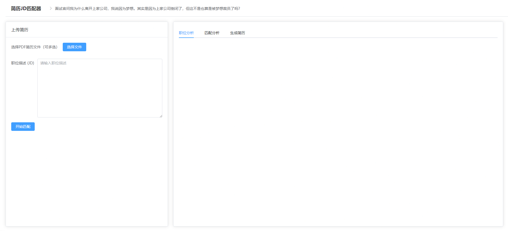

# 简历JD匹配器

基于AI的简历分析工具，帮助求职者快速评估简历与职位JD的匹配程度，提供针对性的优化建议。

## 🖼️ 效果展示


## 🌟 核心功能
- **简历解析**：支持PDF格式简历的智能解析
- **匹配分析**：
  - 技能点匹配度评估
  - 工作经验相关度分析
  - 教育背景适配性评价
- **改进建议**：
  - 针对性的简历优化建议
  - 缺失技能点提醒
  - 表达方式改进提示

## 💻 版本说明
### 本地版本
- ✅ 完整功能支持
- ✅ 实时AI分析
- ✅ 详细匹配报告
- ✅ 私密性保证（数据本地处理）

### 网页版本
- ⚠️ 目前仅支持静态展示
- ⏳ AI分析功能开发中
- 🔜 即将支持在线分析

## 🛠️ 技术实现
- **后端**：Flask + Python
- **前端**：Vue 3 + Element Plus
- **AI能力**：DeepSeek API
- **数据处理**：本地化存储和计算

## 🚀 开始使用
1. 克隆项目到本地
```bash
git clone https://github.com/yourusername/Resume-jd-matcher.git
cd Resume-jd-matcher
```
2. 安装依赖：
```bash
pip install -r requirements.txt
npm install
```
3. 启动本地服务：
```bash
python run.py
npm run dev
```

## 📝 使用提示
1. 准备PDF格式的简历
2. 复制目标职位JD
3. 上传并开始分析
4. 查看详细的匹配报告
5. 根据建议优化简历

## 🔒 隐私说明
- 所有数据本地处理
- 不保存用户简历
- AI分析在本地完成

## 部署

项目支持 Vercel 部署，只需要：

1. Fork 本仓库
2. 在 Vercel 中导入项目
3. 设置环境变量
4. 完成部署

## 文档

- [Element Plus CDN 使用指南](docs/element-plus-cdn.md)

## 贡献

欢迎提交 Issue 和 Pull Request！

## 许可证

MIT 

作者：TTZ